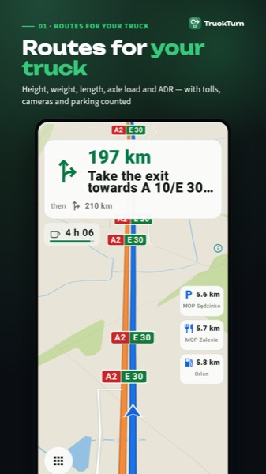
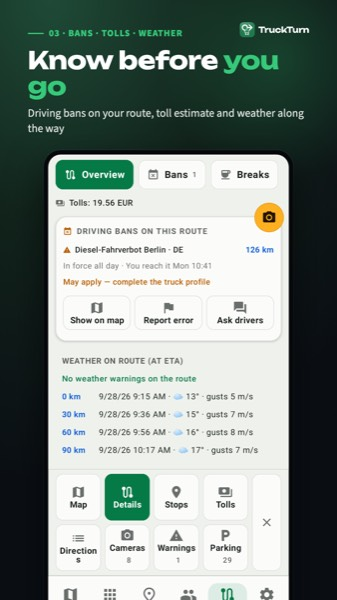
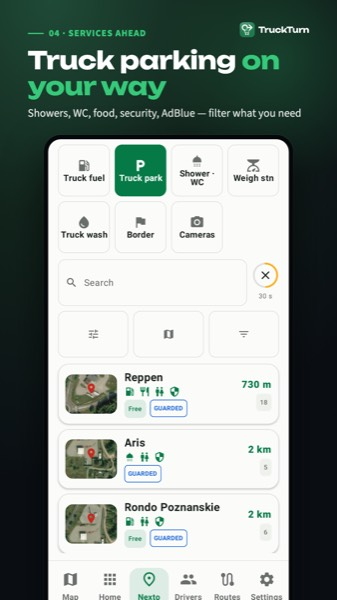
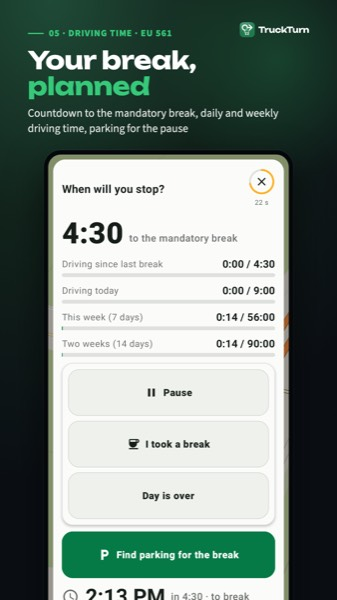

[English](README.md) | [Deutsch](README.de.md) | [Українська](README.uk.md) | [Français](README.fr.md) | [Español](README.es.md) | **Italiano**

# TruckTurn: HGV Navigator

### Navigazione pensata per gli autisti professionisti.

TruckTurn pianifica il percorso per il tuo veicolo reale, mostra cosa c'è davanti e ti mette in contatto con altri autisti. Prima su Android; iOS è in sviluppo.

## Scarica

## Funzioni

- **Percorsi per il tuo camion**: altezza, peso, larghezza, lunghezza, carico per asse e ADR
- **Anteprima del percorso** con alternative, stima dei pedaggi e opzione per evitarli
- **Divieti di circolazione sul percorso** e limiti di altezza, peso e larghezza
- **Incidenti stradali e meteo** lungo la strada
- **Guida vocale** con indicazioni di corsia e limite di velocità
- **Code ai confini in tempo reale** con la corsia camion mostrata separatamente
- **Parcheggi per camion, carburante con AdBlue, pese e autolavaggi** davanti a te
- **Conto alla rovescia del tempo di guida** fino alla prossima pausa (solo stime)
- **Modalità di guida sicura** con comandi grandi e semplici in movimento
- **Driver Connect**: chat con crittografia end-to-end e messaggi vocali
- **Dashcam** con registrazione a ciclo continuo; i clip restano sul tuo telefono
- Mappa diurna e notturna, verticale e orizzontale

## Schermate

   

> Rispetta sempre la segnaletica e il codice della strada. Le informazioni su percorsi e restrizioni possono essere incomplete o non aggiornate.

## Link

- Pagina dell'app: https://nakordoni.eu/en/apps/
- Altre app: https://nakordoni.eu/en/apps/

---

© nakordoni.eu, tutti i diritti riservati.

Software proprietario. Questo repository è solo una vetrina del prodotto; non viene concessa alcuna licenza di riutilizzo dei contenuti.
